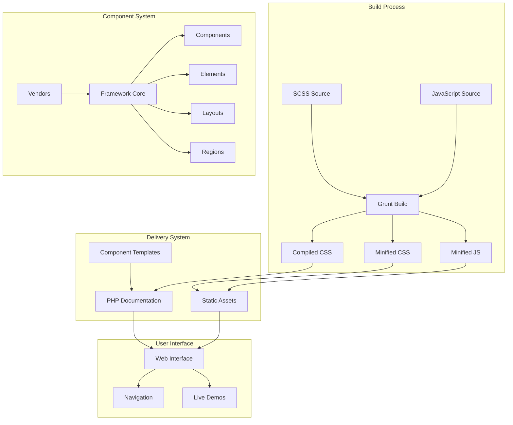
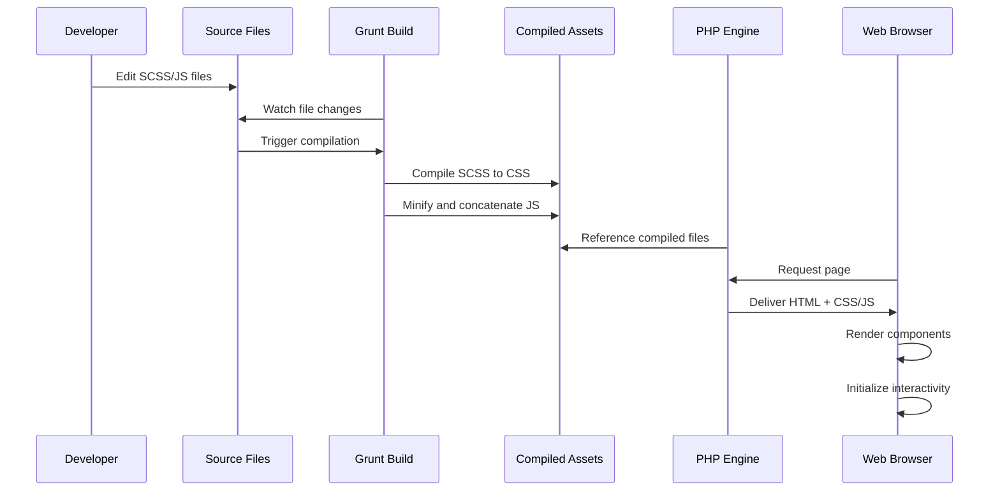

# ldnddev Framework Architecture

## Project Overview

The ldnddev Framework is a modular, atomic design-based CSS/SCSS framework designed for building websites with reusable UI components. It provides a comprehensive component library with PHP-based server-side rendering for documentation and demonstration purposes. The framework emphasizes simplicity and creative control while following modern web development best practices.

**Primary Goal**: Create a maintainable, reusable framework that serves as the foundation for all ldnddev websites with minimal setup overhead and maximum design flexibility.

**Core Features**:
- Atomic design methodology (components, elements, layouts, regions)
- Modular SCSS architecture with configurable variables
- Interactive component library with live examples
- Responsive-first design approach
- Accessibility-compliant components
- RTL language support
- dark/light theme compatibility

## High-Level Architecture



## Key Components & Responsibilities

### 1. Core Framework (`source/scss/`)
**Responsibility**: Define base styles, variables, mixins, and design tokens
- **Variables**: Typography, colors, spacing, breakpoints
- **Mixins**: Reusable style patterns and utilities
- **Normalize**: Cross-browser consistency
- **Partials**: Modular style imports

### 2. Component Library (`templates/components/`)
**Responsibility**: Reusable UI modules with consistent API
- **Interactive**: Accordion, Tabs, Modal, Slider, Search
- **Content**: Hero, Cards, Blocks, Blockquotes, Timeline
- **Layout**: Sections, Grids, Spacers, Alternating layouts
- **Navigation**: Headers, Footers, Breadcrumbs

### 3. Element System (`templates/elements/`)
**Responsibility**: Basic UI building blocks
- **Forms**: Input fields, selects, buttons, validation styles
- **Typography**: Headings, paragraphs, lists, links
- **Media**: Images, videos, responsive embeds

### 4. Vendor Integrations (`assets/vendors/`)
**Responsibility**: 3rd party library management
- **Accessibility**: axe-core for A11y testing
- **Components**: Slick carousel, ResponsiveSlides, Colorbox
- **Icons**: FontAwesome icon system

### 5. Build System (`Gruntfile.js`)
**Responsibility**: Asset compilation and optimization
- SCSS compilation with source maps
- CSS minification and autoprefixing
- JavaScript concatenation and minification
- File watching for development

## Data Flow



## Folder Structure

```
framework.ldnddev.com/
├── source/                     # Source files directory
│   ├── scss/                  # Primary SCSS source
│   │   ├── components/        # Component-specific styles
│   │   ├── elements/          # Basic element styles
│   │   ├── layouts/           # Page layout styles
│   │   ├── regions/           # Template region styles
│   │   ├── partials/          # Reusable SCSS utilities
│   │   ├── fontawesome/       # FontAwesome SCSS integration
│   │   ├── vendors/           # 3rd party library styles
│   │   └── style.scss         # Main compilation entry point
│   ├── js/                    # JavaScript source
│   │   ├── components/        # Component-specific JS
│   │   └── vendors/           # 3rd party libraries
│   └── favicon/              # Favicon source assets
├── web/                       # Document root and demo
│   ├── assets/                # Compiled static assets
│   │   ├── css/               # Compiled and minified CSS
│   │   ├── js/                # Compiled JavaScript
│   │   ├── webfonts/          # Font files
│   │   └── vendors/           # 3rd party libraries
│   ├── includes/              # PHP includes
│   ├── pages/                 # Individual demo pages
│   └── templates/             # Component templates
│       ├── components/        # Reusable component templates
│       ├── elements/          # Basic element templates
│       └── layouts/           # Layout templates
├── Gruntfile.js              # Build configuration
├── package.json              # NPM dependencies
└── .lando.yml               # Local development environment
```

## Tech Stack & Major Decisions

| Layer | Technology | Justification |
|-------|------------|---------------|
| **CSS Framework** | SCSS + Atomic Design | Maintainable, scalable CSS architecture |
| **Build Tool** | Grunt | Reliable, battle-tested build system |
| **JavaScript** | Vanilla JS + HTMX | Lightweight, no framework lock-in |
| **Documentation** | PHP + Static HTML | Simple server-side includes for component demos |
| **Local Dev** | Lando | Consistent development environment |
| **Icons** | FontAwesome Pro | Comprehensive icon set with multiple styles |
| **Animation** | AOS.js | Lightweight scroll animations |

### Major Architectural Decisions

1. **Atomic Design**: Provides clear separation and reusability patterns
2. **PHP-based demos**: Enables server-side includes without complex build step
3. **SCSS custom properties**: Allows runtime theming via CSS variables
4. **HTMX integration**: Adds modern interactivity without JavaScript frameworks
5. **Mobile-first responsive**: Ensures accessibility across devices
6. **Build-time optimization**: Prevents runtime performance issues

## Cross-cutting Concerns

### Authentication & Security
- **Public documentation**: No authentication required for framework docs
- **HTTPS enforcement**: All assets use secure protocols
- **CSP headers**: Prevent XSS through Content Security Policy

### Error Handling
- **PHP includes**: Include guards prevent direct access
- **Graceful degradation**: Components work without JavaScript
- **Build failures**: Grunt provides detailed error messages

### Logging & Monitoring
- **Build logs**: Grunt provides verbose compilation output
- **Browser errors**: Console logging for JavaScript issues
- **Performance monitoring**: Lighthouse integration for web vitals

### Accessibility
- **WCAG 2.1 AA**: All components tested for accessibility compliance
- **Keyboard navigation**: Full keyboard support for interactive components
- **Screen reader support**: ARIA attributes throughout component library
- **Color contrast**: Meets WCAG contrast requirements
- **Focus management**: Proper focus indicators and tab order

### Internationalization
- **RTL support**: Bidirectional text support via CSS logical properties
- **Localized content**: Easy string replacement in templates
- **Font support**: Extended font sets for multiple languages

## Deployment & Environments

### Development Environment (Local)
- **Lando**: Container-based development environment
- **Local URL**: `https://framework.lndo.site`
- **File watching**: Automatic rebuild on source changes
- **Debug mode**: Unminified assets for debugging

### Staging Environment
- **Azure Web App**: Shared hosting for testing
- **URL**: `https://9rt-app-prd-framework-eus.azurewebsites.net`
- **Build deployment**: Minified assets only
- **Access control**: Basic authentication

### Production Environment
- **CDN distribution**: Assets served from CDN when integrated
- **Cache optimization**: Long-term asset caching
- **Versioned assets**: Cache-busting through filename versioning
- **Security headers**: HSTS, CSP, and other security headers

### NPM Package Distribution
- **Package**: `@ldnddev/framework` on npm registry
- **Distribution files**: Minified CSS and JS only
- **Semantic versioning**: MAJOR.MINOR.PATCH format
- **Update mechanism**: npm update for dependent projects

#### Deployment Process
1. **Development**: Local editing with file watching
2. **Testing**: Test in modern browsers (Chrome, Firefox, Safari, Edge)
3. **Review**: Component documentation review for changes
4. **Build**: Run `lando grunt build` for production assets
5. **Deploy**: Push to npm package branch and merge
6. **Publish**: `lando npm publish` to registry

### Environment Configuration

| Environment | Build Target | Minification | Source Maps | Cache Control |
|-------------|--------------|--------------|-------------|---------------|
| Local | development | ❌ | ✅ | No-cache |
| Staging | production | ✅ | ❌ | 1 hour |
| Production | production | ✅ | ❌ | 1 year |

### Continuous Integration
- **Automated builds**: Via GitHub Actions on pull requests
- **Testing**: Automated visual regression testing
- **Accessibility**: axe-core automated testing
- **Performance**: Lighthouse CI integration