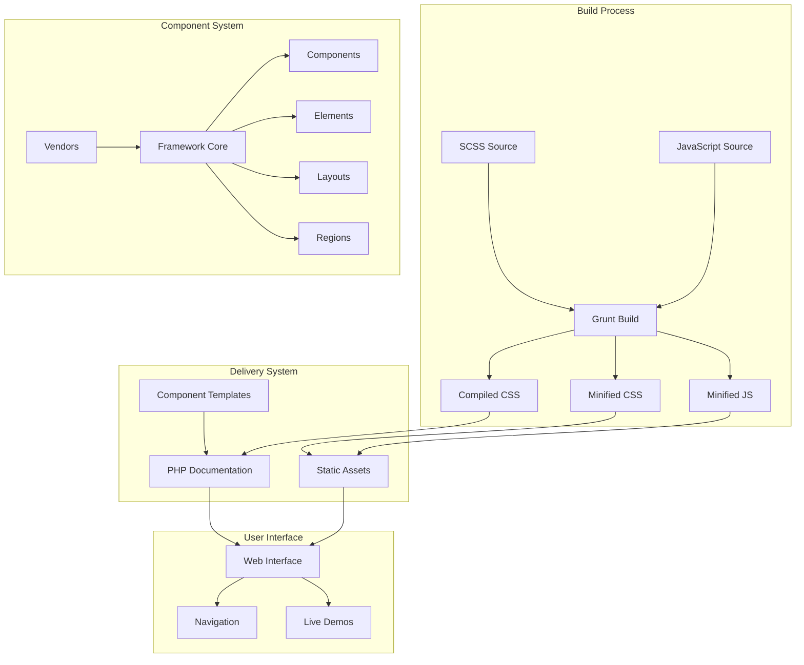

<a href="https://framework.ldnddev.com" target="_blank"></a>
# ldnddev Framework

A modular, atomic design-based CSS/SCSS framework for building responsive, accessible web components across ldnddev websites. Distributed as an npm package (`@ldnddev/dd-framework`).

## Setup Local Development

### Software Requirements
- [Docker](https://docs.docker.com/get-docker/)
- [Lando](https://github.com/lando/lando/releases)
- [Git](https://git-scm.com/downloads)

### Getting Started
```bash
git clone git@github.com:ldnddev/dd_framework.git
cd dd_framework
lando rebuild -y
```

### Dev Commands
```bash
lando grunt build     # Full production build (SCSS, JS, assets)
lando grunt dev       # Build + watch + BrowserSync live reload
lando grunt sync      # BrowserSync + watch (no rebuild)
lando grunt favicon   # Generate favicons from source image
```

## Project Structure

```
source/                  # Source files (edit here)
├── scss/
│   ├── style.scss       # Main SCSS entry point
│   ├── partials/        # Variables, mixins, normalize, grid
│   ├── components/      # Component styles (_dd_*.scss)
│   ├── elements/        # Base element styles
│   ├── regions/         # Header, footer, sidebar styles
│   └── layouts/         # Page layout styles
├── js/
│   ├── main.js          # JS entry point (AOS init)
│   ├── components/      # Component JS (_dd_*.js)
│   └── vendors/         # Third-party JS libraries
└── favicon/             # Source favicon image

web/                     # Document root (compiled output + demo site)
├── assets/              # Compiled CSS, JS, fonts, images
├── templates/           # Component HTML templates
│   ├── components/      # Reusable component templates
│   ├── elements/        # Element templates
│   └── layouts/         # Layout templates
├── pages/               # Demo pages for each component
└── includes/            # PHP includes (head, header, footer)
```

## Components

Templates live in `web/templates/` as `.html` files using BEM naming with the `dd-` prefix.

**Components**: accordion, alert, alternating, banner, blockquote, card, cookie-consent, cta, filmstrip, hero, milestones, modal, section, slider, spacer, tabs, timeline

**Elements**: buttons, forms

**Layouts**: header, footer (small, medium, large, 001)

All components must be wrapped in `dd-section` for proper layout, except `dd-hero`.

## Architecture

### High-Level Build Flow



### Tech Stack

| Layer | Technology | Justification |
|-------|------------|---------------|
| **CSS Framework** | SCSS + Atomic Design | Maintainable, scalable CSS architecture |
| **Build Tool** | Grunt | Reliable, battle-tested build system |
| **JavaScript** | Vanilla JS + HTMX | Lightweight, no framework lock-in |
| **Documentation** | PHP + Static HTML | Simple server-side includes for component demos |
| **Local Dev** | Lando | Consistent development environment |
| **Icons** | FontAwesome Pro | Comprehensive icon set with multiple styles |
| **Animation** | AOS.js | Lightweight scroll animations |
| **Accessibility** | axe-core | Automated A11y testing |

### Key Design Decisions

1. **Atomic Design**: Clear separation and reusability patterns
2. **PHP-based demos**: Server-side includes without a complex build step
3. **SCSS custom properties**: Runtime theming via CSS variables
4. **HTMX integration**: Modern interactivity without JavaScript frameworks
5. **Mobile-first responsive**: Accessibility across devices
6. **Graceful degradation**: Components work without JavaScript

### Accessibility

- WCAG 2.1 AA compliant components
- Full keyboard navigation support
- ARIA attributes and semantic HTML throughout
- Color contrast meets WCAG requirements
- RTL language support via CSS logical properties

## Deployment & Environments

### Development (Local)
- **Lando**: Container-based environment (PHP 8.2, Apache, Node 20)
- **Local URL**: `https://frameworkldnddev.lndo.site:8888`
- **File watching**: Automatic rebuild on source changes

### Staging
- **Azure Web App**: `https://9rt-app-prd-framework-eus.azurewebsites.net`
- **Access control**: Basic authentication

### Production
- CDN distribution when integrated with dependent projects
- Long-term asset caching with versioned filenames

| Environment | Minification | Source Maps | Cache Control |
|-------------|--------------|-------------|---------------|
| Local       | No           | Yes         | No-cache      |
| Staging     | Yes          | No          | 1 hour        |
| Production  | Yes          | No          | 1 year        |

### NPM Package Distribution
- **Package**: `@ldnddev/dd-framework`
- **Distribution**: Minified CSS and JS only
- **Versioning**: Semantic versioning (MAJOR.MINOR.PATCH)

## Contributing

For major changes, create a branch from master. Once fully tested, merge back into master.

## Updating NPM Package

Once changes are approved and merged into master, merge into the `npm-package` branch, then:

1. Increment the version number in `package.json`
2. Add any new components to `/source/scss/dd-framework.scss`
3. Publish:
```bash
lando npm publish --access public
```

## License
[MIT](https://choosealicense.com/licenses/mit/)
